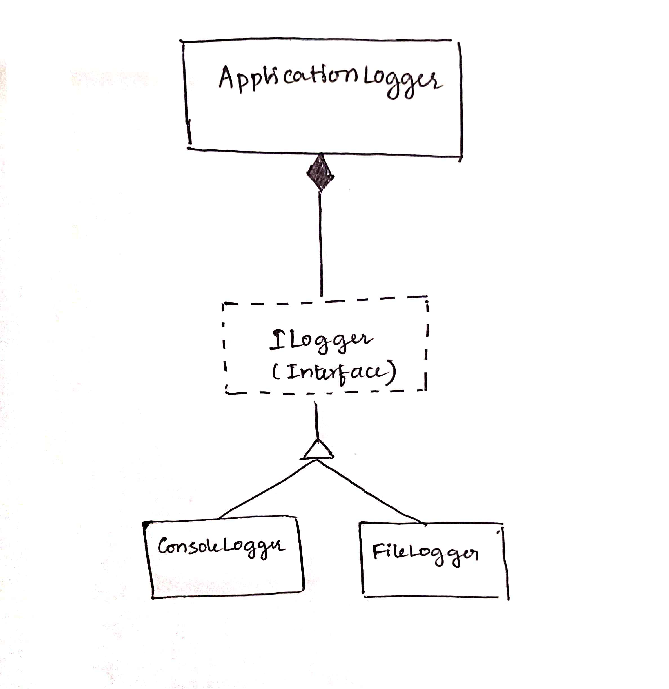

Overview
In object-oriented design, the dependency inversion principle is a specific methodology for loosely coupled software modules. When following this principle, the conventional dependency relationships established from high-level, policy-setting modules to low-level, dependency modules are reversed, thus rendering high-level modules independent of the low-level module implementation details. 

The principle states:
    1.High-level modules should not import anything from low-level modules. Both should depend on abstractions.
    2.Abstractions should not depend on details. Details should depend on abstractions.

By dictating that both high-level and low-level objects must depend on the same abstraction, this design principle inverts the way some people may think about object-oriented programming.

To demonstrate DIP, we need to structure our code so that high-level classes do not depend on low-level classes. Instead, both high-level and low-level classes should depend on abstractions.

Explanation of the DIP Implementation of LoggingSystem:
    1.Abstraction Creation:
        ILogger: An interface that defines the Log method, which all loggers must implement. It serves as the abstraction for logging.

    2.Concrete Implementations:
        ConsoleLogger: A class that implements ILogger to provide logging functionality that writes messages to the console.

        FileLogger: A class that implements the ILogger interface to provide logging functionality by writing messages to a file. In the example code, the FileLogger writes to the console instead of a file to simplify the demonstration and make it easier to understand.

    3.High-Level Module:
        ApplicationLogger: A high-level class that depends on the ILogger abstraction, rather than concrete classes, to log messages.

    Dependency Inversion
    The Application class (the high-level module) depends on the ILogger abstraction, not on specific logger implementations(low-level module) like ConsoleLogger or FileLogger.

Class diagram

Environment
The project builds and runs with Visual Studio Community 2022 when the required workloads are installed.